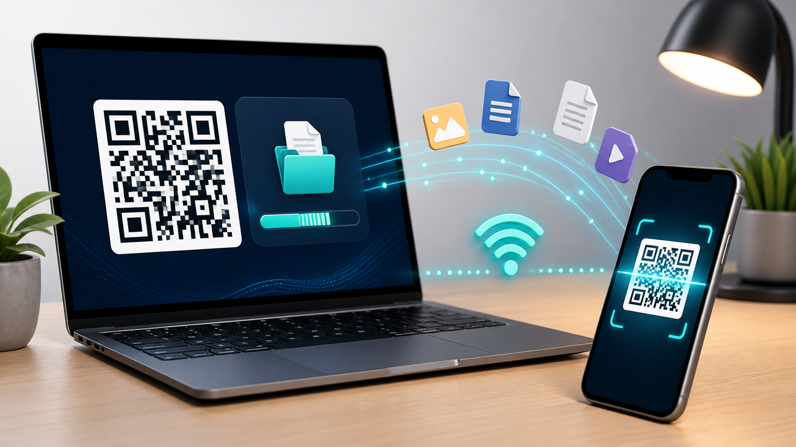

# Transferência por QR Code

[](https://nodejs.org/)
[](LICENSE)
[](https://transferencia-qr.onrender.com/)

Transfira arquivos pelo navegador usando QR Code. O celular pode enviar arquivos para o computador, e o computador também pode gerar um QR Code para o celular baixar um ou vários arquivos.

O projeto funciona em dois modos:

- **Local:** ideal para arquivos grandes, usando a rede Wi-Fi entre celular e computador.
- **Hospedado:** prático para testes e arquivos menores, usando o servidor online como ponte temporária.

## Demonstração

Acesse a versão hospedada:

[https://transferencia-qr.onrender.com/](https://transferencia-qr.onrender.com/)

Na versão online, cada navegador que abre o painel recebe um QR Code próprio. Os arquivos enviados por aquele QR aparecem apenas naquela sessão, evitando que outras pessoas vejam seus downloads.

## Recursos

- QR Code exclusivo por sessão.
- PIN de segurança mostrado no computador antes de liberar o celular.
- Botões para renovar o QR Code ou encerrar a sessão atual.
- Envio de um ou vários arquivos em fila.
- Seleção de pasta com preservação de subpastas quando o navegador informa o caminho relativo.
- Bloco de notas compartilhado entre computador e celular em tempo real.
- Botão para copiar o texto do bloco de notas nos dois lados.
- Compartilhamento de um ou vários arquivos do PC para o celular por QR Code.
- Arrastar e soltar arquivos ou pastas na área de envio do PC.
- Barra de progresso com velocidade e tempo restante.
- Resultado final com tempo total e velocidade média.
- Retomada de envio quando a internet falha, enquanto o servidor continuar ativo.
- Botão para parar o envio atual.
- Opção para descartar um envio pausado.
- Limpeza do histórico de recebidos da sessão.
- Aviso de celular conectado ou desconectado.
- Tema claro/escuro salvo no navegador.
- Avisos para arquivos grandes em MB/GB.
- Download pelo navegador na versão hospedada.
- Escolha de pasta de destino quando rodando localmente no computador.

## Instalação Local

Requisitos:

- [Node.js](https://nodejs.org/) 18 ou superior
- Computador e celular na mesma rede Wi-Fi

Clone o projeto e instale as dependências:

```powershell
git clone https://github.com/tomaziu/transferencia-qr.git
cd transferencia-qr
npm install
```

Inicie o servidor:

```powershell
npm start
```

Depois abra no computador:

```text
http://localhost:3000
```

No Windows, também é possível iniciar pelo `start.bat` depois de instalar as dependências.

## Uso

Receber arquivos do celular:

1. Abra o painel no computador.
2. Escaneie o QR Code com o celular.
3. Digite no celular o PIN mostrado no computador.
4. Selecione um ou mais arquivos, ou uma pasta quando o navegador permitir.
5. Toque em **Enviar**.
6. Acompanhe o progresso no computador.
7. Baixe o arquivo recebido ou, no modo local, confira a pasta configurada.
8. Ao selecionar pasta, as subpastas são recriadas dentro do destino quando o app roda localmente.

Enviar arquivos do PC para o celular:

1. No painel do computador, use **Enviar para celular**.
2. Selecione um ou mais arquivos do PC, uma pasta quando o navegador permitir, ou arraste arquivos/pastas para a área indicada.
3. Clique em **Gerar QR**.
4. Escaneie o novo QR Code com o celular.
5. Toque em **Baixar tudo (.zip)** para manter pastas/subpastas ou baixe cada item da lista separadamente.

Por padrão, os arquivos recebidos localmente ficam na pasta `recebidos`.
No painel local, use o botão de pasta em **Destino** para escolher outro local de salvamento.

Bloco de notas compartilhado:

1. Abra o painel no computador.
2. Escaneie o QR Code no celular.
3. Digite no bloco de notas em qualquer um dos dois.
4. O texto aparece na outra tela automaticamente.

## Arquivos Grandes

Para arquivos grandes, prefira rodar localmente:

- No modo local, o arquivo passa pela sua rede Wi-Fi até o computador.
- No Render grátis, o arquivo precisa passar pela hospedagem e pode falhar se o serviço dormir, reiniciar ou ficar sem espaço temporário.
- O envio é feito em partes de 1 MB, então uma queda de internet pode ser retomada selecionando o mesmo arquivo novamente.

Referência prática:

| Tamanho | Melhor opção | Observação |
| --- | --- | --- |
| Até 500 MB | Local ou hospedado | Hospedado pode funcionar, mas local é mais estável. |
| 1 GB a 5 GB | Local | Use Wi-Fi estável e mantenha as telas abertas. |
| 10 GB ou mais | Local | Recomendado usar PC no cabo de rede e impedir suspensão. |

## Privacidade

Cada painel aberto cria uma sessão própria:

- O QR Code de uma sessão não é igual ao de outra.
- O celular precisa validar o PIN mostrado no computador antes de enviar arquivos ou sincronizar o bloco de notas.
- O histórico de recebidos é filtrado por sessão.
- O link de download também pertence à sessão que recebeu o arquivo.
- **Renovar QR** invalida o QR/PIN antigos.
- **Encerrar sessão** gera um novo QR/PIN e limpa links antigos daquela sessão.

Ainda assim, na versão hospedada os arquivos passam pelo servidor temporário. Para arquivos privados ou muito grandes, rode localmente no seu próprio computador.

## Solução de Problemas

Se o celular não abrir o link:

- Confirme se celular e computador estão na mesma rede Wi-Fi.
- Permita o acesso do Node.js no Firewall do Windows.
- Tente usar o endereço IP exibido no painel.
- Evite VPN ou rede convidada, porque elas podem bloquear comunicação local.

Se o envio ficar lento:

- Aproxime celular e computador do roteador.
- Prefira Wi-Fi 5 GHz quando houver bom sinal.
- Evite bloquear a tela do celular durante o envio.
- No PC, desative suspensão enquanto estiver recebendo arquivos grandes.

## Desenvolvimento

```powershell
npm start
npm test
```

Arquivos principais:

- `server.js`: servidor HTTP, sessões, upload em partes e download.
- `public/app.js`: painel do computador.
- `public/send.js`: tela do celular para enviar arquivos.
- `public/share.js`: tela do celular para baixar arquivos enviados pelo PC.
- `public/styles.css`: estilos da interface.

## Contribuição

Contribuições são bem-vindas. Leia [CONTRIBUTING.md](CONTRIBUTING.md) antes de abrir um pull request.

Para reportar vulnerabilidades, siga [SECURITY.md](SECURITY.md).

## Licença

Este projeto está licenciado sob a [MIT License](LICENSE).
